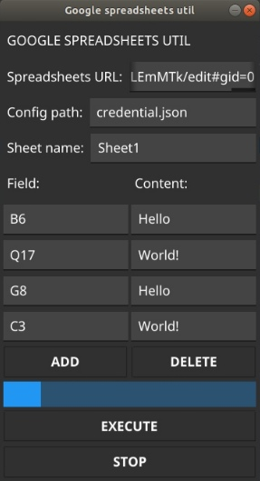

# Google spreadsheet util

This application updates the selected spreadsheet fields with the specified values every second.

To work with the app, you must have a Google Service Account and a credential.json in the specified directory.

  

